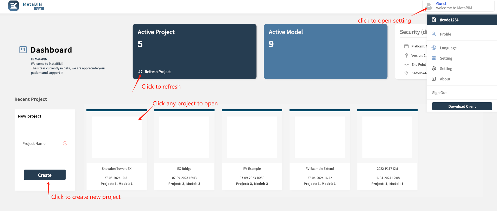
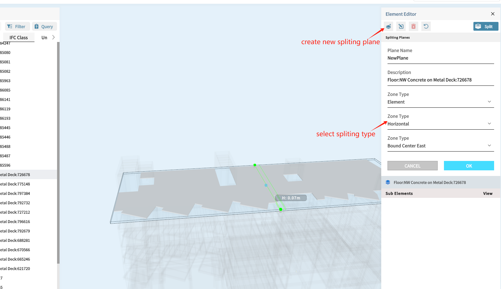
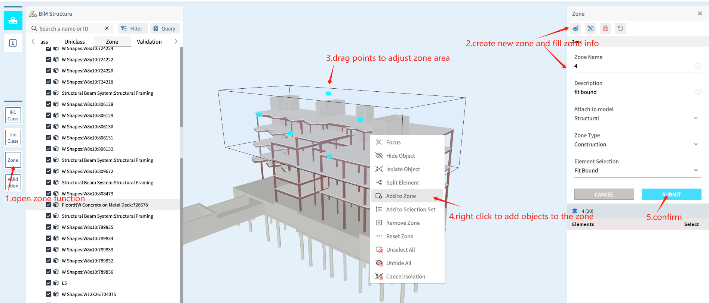

**  Metabim Handbook**

Start from the begining, user Login by default:

phone no : 478279262

code: 000000

When success, the Dashboard will shown

Create new project:

## IFC(BIM) File Management

### Upload

open project from dashboard

wait several minutes until upload finish

### Open Project

when upload finished, you can open the model

## 3D Viewer

### 3D Explore

**Basic Mouse Operations:**

1. Clicking:

    Left Click: select item

    Right Click: show operation options

    Middle mouse button: change view position

2. Dragging:

    Left Drag: move view points

    Right Drag: multi select

3. Scrolling Wheel: Zoon in and out

### Bim Data Viwer

Click on specific element on the model or side bar, show the detailed propertise.

### Bim Data Search

use search bar to search the specific object, use enter key to confirm.

You can also open the detailed search function by click any attributes under Properties

### Bim Data Query

### Data Attribute viewer

#### hide/show

hide or show object by tick it on side bar or click 3D object

#### isolate

Right click object by side bar or 3D object, isolate the object.

The object in isolated status will not influence other objects.

use same way to cancel isolation

## Data Enrich

IFC Class mapping (Working in Progress...)

Uni Class (Working in Progress...)

## Object Spliting

An object may need to be splited, click first split function for single object.

go to spliting editor

splitted sub element can be found in side bar.

## Zone

### create zone by fit bound:

### create zone by object selection:

## Validation(Working in Progress...)

## Data Export

